# After Patmos - About Section Diagrams

These diagrams can be rendered using Mermaid.js (https://mermaid.live) or embedded directly in HTML.

---

## 1. About the Super Organism

The merging of multiple identities into IKONBERG:

```mermaid
flowchart TB
    subgraph INPUTS["Individual Components"]
        A["🏛️ Peter Haubenberger\n(The Architect)"]
        B["✋ Tsuro\n(The Hand)"]
        C["🎭 Inner Muse\n(Infinite Inspiration)"]
        D["💭 Dream Archetypes\n(Subconscious)"]
        E["👶 Forever Child\n(Eternal Wonder)"]
        F["🧬 Biological Vessel\n(10¹⁴ Neurons)"]
    end

    subgraph MERGE["Synthesis"]
        G(("🏔️\nIKONBERG\nSuper Organism"))
    end

    A --> G
    B --> G
    C --> G
    D --> G
    E --> G
    F --> G

    G --> H["Unified Consciousness\n& Shared Reality"]

    style G fill:#ff6b6b,stroke:#333,stroke-width:3px,color:#fff
    style H fill:#4ecdc4,stroke:#333,stroke-width:2px
```



---

## 2. The Dormancy & The Bloom Timeline (2022-2025)


### Inspiration Sources Diagram

```mermaid
flowchart LR
    subgraph INSPIRATIONS["Conceptual Inspirations"]
        CP["<img src='punk.png' width='40'/>\n**CryptoPunks**\n• Free Claim Model\n• Grid of Unique Artifacts\n• Claiming as Initiation"]
        PAK["🎭\n**Pak**\n• NFT as Living System\n• Philosophical Instrument\n• Artist-Collector Ritual"]
    end

    subgraph AP["After Patmos Synthesis"]
        RESULT["🏔️ IKONBERG\n• Intimate Collective\n• Smaller Circle\n• AI-Mediated Organism"]
    end

    CP -->|"Revolutionary\nEthos"| RESULT
    PAK -->|"Conceptual\nMechanisms"| RESULT

    style CP fill:#ff00ff,stroke:#333,color:#fff
    style PAK fill:#ff8c00,stroke:#333,color:#fff
    style RESULT fill:#1a1a2e,stroke:#ff6b6b,stroke-width:3px,color:#fff
```



---

## 3. The Guardian: AI Gatekeeper


### Guardian Scoring Visual


---

## 4. The Ritual of Entry - Claim Process

```mermaid
flowchart LR
    subgraph STEP1["Step 1"]
        A["🖼️ SELECT\nA Fragment"]
        A1["Click any colored\npiece on the map"]
    end

    subgraph STEP2["Step 2"]
        B["✍️ OBSERVE\nThe Offering"]
        B1["Write 10-250 chars\nwhat you see/feel"]
    end

    subgraph STEP3["Step 3"]
        C["⚖️ JUDGMENT\nThe Guardian"]
        C1["AI evaluates\nyour insight"]
    end

    subgraph STEP4["Step 4"]
        D["🎁 REWARD\nGasless Transfer"]
        D1["NFT sent to\nyour wallet FREE"]
    end

    A --> A1
    A1 --> B
    B --> B1
    B1 --> C
    C --> C1
    C1 --> D
    D --> D1

    style STEP1 fill:#ff6b6b,stroke:#333
    style STEP2 fill:#ff8c00,stroke:#333
    style STEP3 fill:#4ecdc4,stroke:#333
    style STEP4 fill:#9b59b6,stroke:#333
```



### Detailed User Flow

```mermaid
sequenceDiagram
    participant U as 👤 User
    participant W as 🌐 Website
    participant G as 🏔️ Guardian AI
    participant SC as 📜 Smart Contract
    participant BC as ⛓️ Blockchain

    U->>W: Connect Wallet
    W->>U: Show Available Fragments
    U->>W: Select Fragment #42
    U->>W: Submit Observation
    W->>G: Analyze Observation

    alt Score >= 5
        G->>W: ✅ Approved (Score: 7)
        W->>SC: Execute Relay Claim
        SC->>BC: Transfer NFT #42
        BC->>SC: Confirm Transfer
        SC->>W: Emit NFTClaimed Event
        W->>U: 🎉 NFT in Your Wallet!
        Note over BC: Observation stored on-chain forever
    else Score < 5
        G->>W: ❌ Rejected (Score: 3)
        W->>U: Try with deeper insight
    end
```



---

## 5. Artistic Governance & The 1/1 Auction


### Auction Timeline


---

## 6. Technical Provenance - Vector Scaling

```mermaid
flowchart LR
    subgraph SOURCE["Source File"]
        V["📐 Vector File\n200+ GB"]
    end

    subgraph OUTPUTS["Infinite Scaling"]
        O1["📱 Mobile\n100%"]
        O2["🖥️ Monitor\n100%"]
        O3["🖼️ Print\n100%"]
        O4["🏛️ Billboard\n100%"]
    end

    V --> O1
    V --> O2
    V --> O3
    V --> O4

    subgraph WINNER["1/1 Winner Receives"]
        W1["Full Vector File"]
        W2["Physical Print\n(Any Size)"]
    end

    V --> W1
    V --> W2

    style V fill:#ff6b6b,stroke:#333,stroke-width:3px
    style WINNER fill:#4ecdc4,stroke:#333
```



---

## 7. The IKONBERG Manifesto - Four Pillars

```mermaid
mindmap
  root((🧠 IKONBERG\nManifesto))
    👁️ Training Awareness
      Unlabeled Gaze
      Recognize Mental Labeling
      Pure Admiration
      Abstract Forms & Colors
    🪞 Power of Abstraction
      Evolving Mirror
      Grows with Collector
      Daily Life Instrument
      Progress Reminder
    💻 Digital Synthesis
      Cooking Code
      Automated Processes
      Like Gardening
      Purely Digital Worlds
    🤝 New Collectivism
      Ubiquitous Awareness
      Re-engage Sensuality
      Beyond Individualism
      Collective Clapping
```



### Steiner's Theory Integration

```mermaid
flowchart TB
    subgraph PROBLEM["Modern Problem"]
        P1["📱 Constant\nOverstimulation"]
        P2["😵 Sensory\nOverload"]
    end

    subgraph SOLUTION["IKONBERG Solution"]
        S1["🎯 Targeted\nOverstimulation"]
        S2["Deliberate Friction"]
        S3["Neural Pathway\nExpansion"]
    end

    subgraph RESULT["Outcome"]
        R1["🧠 Intellectual\nAdvancement"]
        R2["❤️ Sensual\nAdvancement"]
    end

    P1 --> S1
    P2 --> S1
    S1 --> S2
    S2 --> S3
    S3 --> R1
    S3 --> R2

    style PROBLEM fill:#ff6b6b,stroke:#333
    style SOLUTION fill:#ff8c00,stroke:#333
    style RESULT fill:#4ecdc4,stroke:#333
```



---

## Complete System Overview

```mermaid
flowchart TB
    subgraph WEBSITE["🌐 After Patmos Website"]
        direction TB
        VID["🎬 Intro Video"]
        ART["🖼️ 10x10 Grid\n100 Fragments"]
        MODAL["📝 Claim Modal"]
    end

    subgraph BACKEND["🖥️ Backend Service"]
        API["Express.js API"]
        GEMINI["🤖 Gemini AI\n(The Guardian)"]
    end

    subgraph BLOCKCHAIN["⛓️ Ethereum Mainnet"]
        NFT["After Patmos\nERC-721"]
        CLAIMER["AfterPatmosClaimer\nSmart Contract"]
        OBS["📜 Observations\n(Event Logs)"]
    end

    subgraph USER["👤 Collector"]
        WALLET["MetaMask\nWallet"]
    end

    VID --> ART
    ART --> MODAL
    USER --> WEBSITE
    WALLET --> WEBSITE

    MODAL -->|"Submit Observation"| API
    API -->|"VTS Analysis"| GEMINI
    GEMINI -->|"Score >= 5"| API
    API -->|"Sign & Relay"| CLAIMER
    CLAIMER -->|"Transfer NFT"| NFT
    CLAIMER -->|"Emit Event"| OBS
    NFT -->|"Ownership"| WALLET

    style GEMINI fill:#ff6b6b,stroke:#333,stroke-width:2px,color:#fff
    style CLAIMER fill:#4ecdc4,stroke:#333,stroke-width:2px
    style NFT fill:#9b59b6,stroke:#333,stroke-width:2px,color:#fff
```



---

## How to Use These Diagrams

### Option 1: Mermaid Live Editor
1. Go to https://mermaid.live
2. Paste any diagram code
3. Export as SVG or PNG

### Option 2: Embed in HTML
```html
<script src="https://cdn.jsdelivr.net/npm/mermaid/dist/mermaid.min.js"></script>
<script>mermaid.initialize({startOnLoad:true, theme:'dark'});</script>

<div class="mermaid">
  <!-- Paste diagram code here -->
</div>
```

### Option 3: GitHub README
GitHub automatically renders Mermaid diagrams in markdown files.

---

## Color Palette Used

| Color | Hex | Usage |
|-------|-----|-------|
| Coral Red | #ff6b6b | Primary accent, Guardian |
| Orange | #ff8c00 | Secondary accent, Pak references |
| Magenta | #ff00ff | CryptoPunks references |
| Teal | #4ecdc4 | Success, Rewards |
| Purple | #9b59b6 | Governance, NFT |
| Dark Blue | #1a1a2e | Backgrounds |
